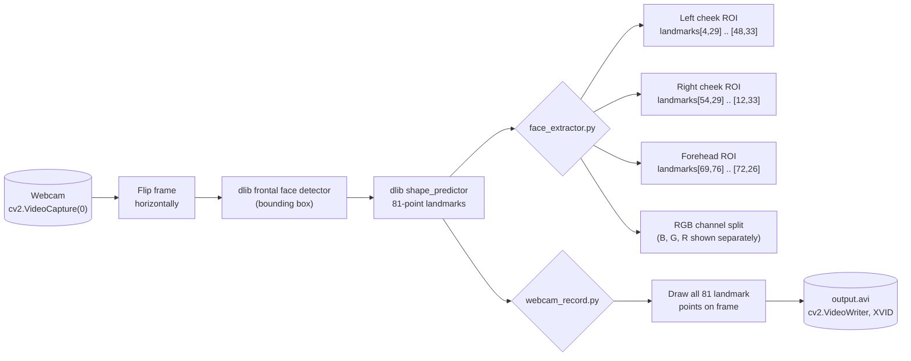

# Face Extraction — Cheek & Forehead ROI

Fork of [version0chiro/Face_extraction](https://github.com/version0chiro/Face_extraction).

Simple OpenCV/dlib scripts, intended to run on a Raspberry Pi, that grab
frames from a webcam, detect a face with dlib's 81-point facial landmark
predictor, and crop out the regions of interest (ROI) most useful for
remote photoplethysmography (rPPG) — the forehead and both cheeks — by
indexing into the predicted landmark points.

## What's in here

- `face_extractor.py` — opens the default camera, runs `dlib`'s frontal face
  detector + the 81-point shape predictor on each frame, draws rectangles
  around three ROIs (left cheek, right cheek, forehead) computed from
  specific landmark indices, and also splits the frame into its raw B/G/R
  channel images (all shown live in separate `cv2.imshow` windows).
- `webcam_record.py` — a simpler capture script: detects the face, draws all
  81 landmark points as dots on the frame, and records the annotated video
  to `output.avi` (XVID codec) while previewing it live.
- `shape_predictor_68_face_landmarks.dat` / `shape_predictor_81_face_landmarks.dat` —
  pretrained dlib landmark models (68-point is the standard dlib model; the
  81-point model, used by `face_extractor.py`, adds forehead landmarks that
  the standard 68-point model lacks).

## Tech stack

Python, OpenCV (`cv2`), `dlib` (face detection + landmark prediction),
`imutils`, `scikit-image`, NumPy.

## Architecture



`face_extractor.py` is the core of the project: for every detected face it
computes three axis-aligned bounding boxes directly from landmark
coordinates (no separate segmentation model) to isolate the forehead and
cheek skin regions — useful as a pre-processing step for tasks like rPPG
heart-rate estimation, where skin-region color changes are analyzed per
video frame. `webcam_record.py` is a standalone utility for visualizing/
recording the full landmark set instead of cropping ROIs.

## Setup / How to run

```bash
pip install opencv-python dlib imutils scikit-image numpy
python face_extractor.py     # live ROI + channel-split preview, 'q' to quit
python webcam_record.py      # live landmark preview, records to output.avi
```

Both scripts expect a webcam at index 0 and the corresponding `.dat`
landmark file in the working directory.
